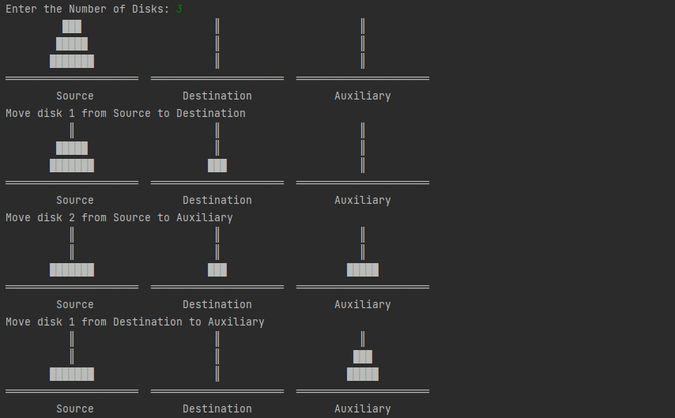

# Visualise Tower of Hanoi

### Tower of hanoi is a classic programming problem which is used to understand the concepts of Divide and Concur and Recursion.
## Summary
### I got an assignment to make a program to solve tower of hanoi problem. I thought Why not make it a little challenging and make something out of the box.
### This was very tough project, and it tested my patience more than once. I had to think of new logic to get this program to work.